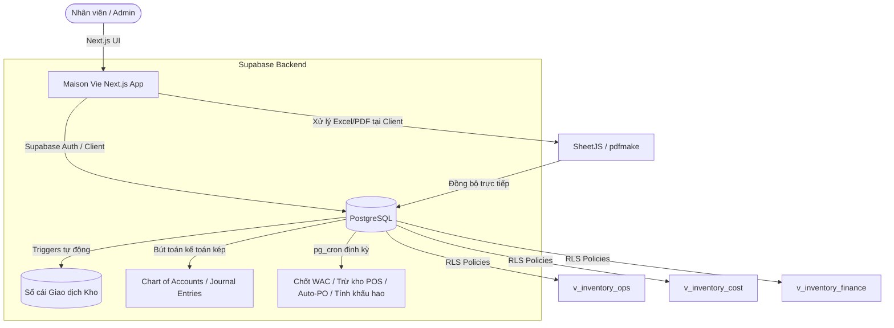

# KẾ HOẠCH TRIỂN KHAI TÍCH HỢP HỆ THỐNG POS-INVEN (STOCKY) VÀO MAISON VIE CRM/INVENTORY (V2.0)
### (Hợp nhất toàn bộ phân hệ: Store · People · User Management · Product · Adjustment · Purchases · Sales & Return · Transfer · Damages · HRM · Accounting · Settings)

> **Vai trò biên soạn**: Kiến trúc sư Dữ liệu Full-Stack / Kế toán trưởng hệ thống
> **Hạ tầng mục tiêu**: Supabase (PostgreSQL / RLS / pg_cron / Storage) + Vercel (Next.js / React) + GitHub (private repository).
> **Nguyên tắc cốt lõi**: *"Database-centric, serverless-thin"* — giữ nguyên tính bảo mật RLS và tốc độ tải trang, giảm thiểu chi phí vận hành hạ tầng bằng cách render client-side và tích hợp toàn bộ nghiệp vụ chạy tự động trong PostgreSQL qua pg_cron.

---

## 1. PHÂN TÍCH KHẢ THI & BẢN ĐỒ TÍCH HỢP HỆ THỐNG (INTEGRATION MAP)

Hoàn toàn có thể tích hợp tất cả các module riêng biệt của Stocky vào hệ thống Next.js + Supabase hiện tại của Maison Vie. Dưới đây là bản đồ thiết kế kỹ thuật chi tiết cho từng phân hệ:



---

## 2. THIẾT KẾ KỸ THUẬT CHI TIẾT CHO CÁC PHÂN HỆ CỦA STOCKY

### 2.1. Phân hệ Store & Quản lý Địa điểm
* **Mô tả**: Quản lý kho tổng, kho bếp, kho quầy Bar, và cửa hàng online (Online Store).
* **Giải pháp Supabase**:
  * Đã có bảng `locations` ('MAIN_STORE', 'KITCHEN', 'BAR').
  * Bổ sung bảng `online_store_settings` để cấu hình: Cho phép bán quá hạn (overselling), ẩn hàng hết kho, hoặc bật/tắt toàn bộ cửa hàng online.
* **Database Schema**:
  ```sql
  CREATE TABLE IF NOT EXISTS online_store_settings (
    id serial PRIMARY KEY,
    is_active boolean DEFAULT true NOT NULL,
    allow_overselling boolean DEFAULT false NOT NULL,
    hide_out_of_stock boolean DEFAULT true NOT NULL,
    stripe_public_key text,
    stripe_secret_key text,
    updated_at timestamp with time zone DEFAULT now()
  );
  ```

### 2.2. Phân hệ People (Đối tác & Khách hàng)
* **Mô tả**: Quản lý Nhà cung cấp (Suppliers), Khách hàng (Customers), và Kỹ thuật viên (Technicians - bảo trì máy móc).
* **Giải pháp Supabase**:
  * Đã có bảng `suppliers` và `supplier_ingredients`.
  * Bổ sung bảng `customers` (để quản lý công nợ, điểm tích lũy, hạn mức nợ) và bảng `technicians`.
* **Database Schema**:
  ```sql
  CREATE TABLE IF NOT EXISTS customers (
    id uuid PRIMARY KEY DEFAULT gen_random_uuid(),
    name text NOT NULL,
    phone text NOT NULL UNIQUE,
    email text,
    address text,
    credit_limit numeric(15, 2) DEFAULT 0.00, -- Hạn mức nợ
    opening_balance numeric(15, 2) DEFAULT 0.00, -- Nợ đầu kỳ
    loyalty_points integer DEFAULT 0 NOT NULL, -- Điểm tích lũy
    custom_fields jsonb DEFAULT '{}'::jsonb, -- Các trường tùy chỉnh thêm
    is_active boolean DEFAULT true NOT NULL,
    created_at timestamp with time zone DEFAULT now()
  );

  CREATE TABLE IF NOT EXISTS technicians (
    id uuid PRIMARY KEY DEFAULT gen_random_uuid(),
    profile_id uuid REFERENCES profiles(id) ON DELETE SET NULL,
    specialty text, -- Chuyên môn (ví dụ: Điện lạnh, Thiết bị bếp)
    is_active boolean DEFAULT true NOT NULL
  );
  ```

### 2.3. Phân hệ User Management & Login Device Control
* **Mô tả**: Phân quyền nhân viên, giới hạn kho truy cập, giám sát phiên làm việc (Login Sessions) và lịch sử đăng nhập.
* **Giải pháp Supabase**:
  * Đăng nhập thiết bị tại quầy bằng tài khoản chung, bartender thao tác bằng **PIN cá nhân** để quy trách nhiệm cụ thể.
  * Bảng `user_locations` liên kết tài khoản với kho được phép thao tác.
* **Database Schema**:
  ```sql
  CREATE TABLE IF NOT EXISTS user_locations (
    profile_id uuid REFERENCES profiles(id) ON DELETE CASCADE,
    location_id text REFERENCES locations(id) ON DELETE CASCADE,
    PRIMARY KEY (profile_id, location_id)
  );

  CREATE TABLE IF NOT EXISTS login_activity (
    id uuid PRIMARY KEY DEFAULT gen_random_uuid(),
    profile_id uuid REFERENCES profiles(id) ON DELETE CASCADE,
    ip_address text,
    user_agent text,
    device_info text,
    login_at timestamp with time zone DEFAULT now() NOT NULL
  );
  ```

### 2.4. Phân hệ Product (Import, Update, Opening Stock, Count Stock)
* **Mô tả**: Import Excel nguyên vật liệu (chỉ thêm mới hoặc chỉ cập nhật giá vốn/đơn giá), nạp tồn kho đầu kỳ và giao diện đếm kho (Count Stock).
* **Giải pháp Next.js/Supabase**:
  * **Import Excel**: Xử lý hoàn toàn ở client bằng **SheetJS**. Trình duyệt đọc file, kiểm tra mã sản phẩm:
    * Chế độ *Import Products*: Chèn `ON CONFLICT (code) DO NOTHING` vào bảng `ingredients`.
    * Chế độ *Import (Update Only)*: Chạy lệnh `UPDATE ingredients SET wac_price = ..., standard_price = ... WHERE code = ...`.
  * **Count Stock (Kiểm kho)**: Đã có bảng `stock_takes` và `stock_take_lines`. Thêm bộ lọc danh mục (Category Filter) để nhân viên đếm theo nhóm (Ví dụ: Chỉ kiểm kho Rượu hoặc chỉ kiểm kho Rau củ).

### 2.5. Phân hệ Adjustment (Điều chỉnh kho)
* **Mô tả**: Ghi nhận các đợt cân đối kho đột xuất do sai lệch hoặc lỗi nhập liệu từ Admin mà không qua quy trình mua hàng.
* **Giải pháp Supabase**:
  * Bút toán điều chỉnh sẽ được ghi nhận vào bảng `stock_adjustments` và sinh giao dịch `STOCK_TAKE_ADJ` trong sổ cái.
* **Database Schema**:
  ```sql
  CREATE TABLE IF NOT EXISTS stock_adjustments (
    id uuid PRIMARY KEY DEFAULT gen_random_uuid(),
    adjustment_no text UNIQUE NOT NULL,
    location_id text REFERENCES locations(id) NOT NULL,
    reason text NOT NULL,
    created_by uuid REFERENCES profiles(id),
    created_at timestamp with time zone DEFAULT now() NOT NULL
  );

  CREATE TABLE IF NOT EXISTS stock_adjustment_lines (
    adjustment_id uuid REFERENCES stock_adjustments(id) ON DELETE CASCADE,
    ingredient_id varchar(50) REFERENCES ingredients(id) ON DELETE CASCADE,
    qty_adjusted numeric(12, 4) NOT NULL, -- Số lượng điều chỉnh (Dương = Tăng, Âm = Giảm)
    PRIMARY KEY (adjustment_id, ingredient_id)
  );
  ```

### 2.6. Phân hệ Purchases & Label Printing
* **Mô tả**: Đơn đặt hàng (PO), nhập kho (GRN) từ file Excel, và in mã vạch (Barcode/Label) trực tiếp từ hóa đơn mua hàng.
* **Giải pháp Next.js/Supabase**:
  * Đã có bảng `purchase_orders`, `po_lines`, `goods_receipts` và `grn_lines`.
  * Bổ sung tính năng sinh và in Barcode dạng nhãn dán (Sticker) trực tiếp trên Next.js sử dụng thư viện `@node-js/barcode` hoặc `react-to-print` từ thông tin của phiếu nhận hàng (GRN).

### 2.7. Phân hệ Sales & Sales Return
* **Mô tả**: Sinh hóa đơn bán hàng trực tiếp (dành cho tiệc lớn, catering) và quản lý hàng trả lại (Sales Return).
* **Giải pháp Supabase**:
  * Đã có bảng `sales_imports` để import dữ liệu từ POS của nhà hàng.
  * Bổ sung bảng `sales` và `sale_returns` để quản lý các hóa đơn bán hàng thủ công không qua máy POS.
* **Database Schema**:
  ```sql
  CREATE TABLE IF NOT EXISTS sales (
    id uuid PRIMARY KEY DEFAULT gen_random_uuid(),
    invoice_no text UNIQUE NOT NULL,
    customer_id uuid REFERENCES customers(id),
    location_id text REFERENCES locations(id) NOT NULL,
    subtotal numeric(15, 2) NOT NULL,
    tax_percent numeric(5, 2) DEFAULT 10.00 NOT NULL,
    discount_amount numeric(15, 2) DEFAULT 0.00 NOT NULL,
    total_amount numeric(15, 2) NOT NULL,
    payment_method text NOT NULL, -- 'CASH', 'CARD', 'TRANSFER', 'MULTIPLE'
    created_by uuid REFERENCES profiles(id),
    created_at timestamp with time zone DEFAULT now() NOT NULL
  );

  CREATE TABLE IF NOT EXISTS sale_items (
    sale_id uuid REFERENCES sales(id) ON DELETE CASCADE,
    ingredient_id varchar(50) REFERENCES ingredients(id) NOT NULL,
    qty_sold numeric(12, 4) NOT NULL,
    unit_price numeric(15, 2) NOT NULL,
    PRIMARY KEY (sale_id, ingredient_id)
  );

  CREATE TABLE IF NOT EXISTS sale_returns (
    id uuid PRIMARY KEY DEFAULT gen_random_uuid(),
    return_no text UNIQUE NOT NULL,
    sale_id uuid REFERENCES sales(id) ON DELETE SET NULL,
    customer_id uuid REFERENCES customers(id),
    total_refund numeric(15, 2) NOT NULL,
    created_by uuid REFERENCES profiles(id),
    created_at timestamp with time zone DEFAULT now() NOT NULL
  );
  ```

### 2.8. Phân hệ Transfer (Chuyển kho nội bộ có Duyệt)
* **Mô tả**: Chuyển nguyên vật liệu giữa các kho (Ví dụ: Kho tổng $\rightarrow$ Bếp, Kho tổng $\rightarrow$ Bar).
* **Giải pháp Supabase**:
  * Đã có thuộc tính `transfer_id` trong giao dịch kho.
  * Bổ sung bảng quản lý quy trình chuyển kho `stock_transfers` để bắt buộc qua bước duyệt của Quản lý hoặc Thủ kho trước khi trừ kho nguồn và tăng kho đích.
* **Database Schema**:
  ```sql
  CREATE TABLE IF NOT EXISTS stock_transfers (
    id uuid PRIMARY KEY DEFAULT gen_random_uuid(),
    transfer_no text UNIQUE NOT NULL,
    from_location_id text REFERENCES locations(id) NOT NULL,
    to_location_id text REFERENCES locations(id) NOT NULL,
    status text DEFAULT 'PENDING' CHECK (status IN ('PENDING', 'APPROVED', 'REJECTED')),
    approved_by uuid REFERENCES profiles(id),
    created_by uuid REFERENCES profiles(id),
    created_at timestamp with time zone DEFAULT now() NOT NULL
  );

  CREATE TABLE IF NOT EXISTS stock_transfer_lines (
    transfer_id uuid REFERENCES stock_transfers(id) ON DELETE CASCADE,
    ingredient_id varchar(50) REFERENCES ingredients(id) ON DELETE CASCADE,
    qty_transfer numeric(12, 4) NOT NULL,
    PRIMARY KEY (transfer_id, ingredient_id)
  );
  ```

### 2.9. Phân hệ Damages (Quản lý hàng Hỏng/Hao hụt bếp)
* **Mô tả**: Ghi nhận hao hụt, vỡ hỏng nguyên vật liệu trong ca làm việc.
* **Giải pháp Supabase**:
  * Đã có bảng `waste_logs` cho Bếp và Bar. Bổ sung RLS tự động duyệt nếu giá trị hao hụt dưới 200,000đ; nếu lớn hơn phải chờ Quản lý duyệt.

### 2.10. Phân hệ HRM & Quản lý Ca (Attendance / Payroll)
* **Mô tả**: Theo dõi ca làm việc, giờ công của nhân viên tại quầy bếp/bar, tính lương cơ bản.
* **Giải pháp Supabase**:
  * Tận dụng máy tính bảng dùng chung tại quầy. Nhân viên nhập mã PIN cá nhân để chấm công (Clock-in / Clock-out).
* **Database Schema**:
  ```sql
  CREATE TABLE IF NOT EXISTS employee_attendance (
    id uuid PRIMARY KEY DEFAULT gen_random_uuid(),
    profile_id uuid REFERENCES profiles(id) ON DELETE CASCADE,
    clock_in timestamp with time zone DEFAULT now() NOT NULL,
    clock_out timestamp with time zone,
    total_hours numeric(5, 2),
    business_date date NOT NULL
  );
  ```

### 2.11. Phân hệ Accounting (Hệ thống Kế toán Kép CoA & Journal)
* **Mô tả**: Hệ thống tài khoản, Bút toán kép tự động sinh từ giao dịch nhập/xuất kho.
* **Giải pháp Supabase**:
  * Triển khai trigger tự động trên bảng `inventory_transactions` để sinh bút toán ghi nợ/có (Debit/Credit) vào hệ thống tài khoản tương ứng, đảm bảo dữ liệu kế toán luôn khớp với thực tế kho.

### 2.12. Phân hệ Settings (Email, SMS, Custom SMS, Currency, Login Management)
* **Mô tả**: Cấu hình hệ thống động từ Admin Panel.
* **Giải pháp Supabase**:
  * Tạo bảng `system_settings` để lưu cấu hình: Tên nhà hàng, VAT mặc định, đơn vị tiền tệ chính, cấu hình API Email (Resend) và SMS (Termii/Custom).
* **Database Schema**:
  ```sql
  CREATE TABLE IF NOT EXISTS system_settings (
    id serial PRIMARY KEY,
    restaurant_name text NOT NULL,
    default_vat numeric(5, 2) DEFAULT 10.00 NOT NULL,
    base_currency text DEFAULT 'VND' NOT NULL,
    email_api_key text, -- API Key của Resend/Sendgrid
    email_from text,
    sms_api_key text,
    sms_sender_id text,
    sms_gateway_url text, -- Cho phép custom gateway
    updated_at timestamp with time zone DEFAULT now()
  );
  ```

---

## 3. LỘ TRÌNH TRIỂN KHAI PHÁT TRIỂN (ROADMAP)

Chúng ta sẽ tiến hành triển khai theo 4 giai đoạn, tích hợp dần các tính năng của Stocky vào hệ thống Next.js / Supabase của Maison Vie:

| Giai đoạn | Nội dung thực hiện | Kết quả bàn giao |
| :--- | :--- | :--- |
| **Giai đoạn 1** | **Database & RLS Migration** <br> Chạy các tập lệnh SQL mở rộng database trong Supabase Editor, cập nhật file `schema.sql` của dự án. | Đầy đủ cấu hình bảng mới, phân quyền RLS chặt chẽ cho từng vai trò trên Supabase. |
| **Giai đoạn 2** | **Frontend Core Modules (Product & Adjustment)** <br> Xây dựng giao diện Next.js cho việc Import Excel (Thêm mới/Cập nhật giá), nạp Opening Stock, và giao diện kiểm kê Count Stock có bộ lọc. | Nhân viên và quản lý có thể thao tác nạp kho đầu kỳ, import giá vốn hàng loạt từ file Excel. |
| **Giai đoạn 3** | **Transaction & Operations (Transfer, Sales & Return)** <br> Lập trình giao diện chuyển kho nội bộ có quy trình duyệt, xuất hóa đơn thủ công và tạo phiếu hư hỏng. | Hoàn thiện 100% luồng vận hành kho vật lý giữa Kho tổng $\rightarrow$ Bếp $\rightarrow$ Bar. |
| **Giai đoạn 4** | **Financial & Integrations (Accounting & Settings)** <br> Tích hợp tự động sinh bút toán kế toán kép, tích hợp WooCommerce/QuickBooks và API gửi thông báo SMS/Email. | Hệ thống kế toán hoàn chỉnh tự động vận hành, tự báo cáo P&L và kết nối đồng bộ bên ngoài. |

---

## 4. QUY TRÌNH KIỂM SOÁT BẤT BIẾN DỮ LIỆU (AUDIT CONTROL)

* Mọi hoạt động thêm mới hoặc cập nhật hàng loạt từ file Excel (Import) đều được ghi nhận vào bảng `audit_log` kèm theo snapshot dữ liệu trước và sau khi thay đổi (`before_data`, `after_data`).
* Không một tài khoản nào (kể cả Admin) được quyền sửa đổi trực tiếp số lượng tồn kho trong bảng `inventory_transactions`. Mọi sửa đổi bắt buộc phải thông qua phiếu điều chỉnh kho (`stock_adjustments`) để ghi nhận giao dịch tăng/giảm rõ ràng, bảo vệ tính minh bạch tài chính tối đa cho nhà hàng fine-dining Maison Vie.
