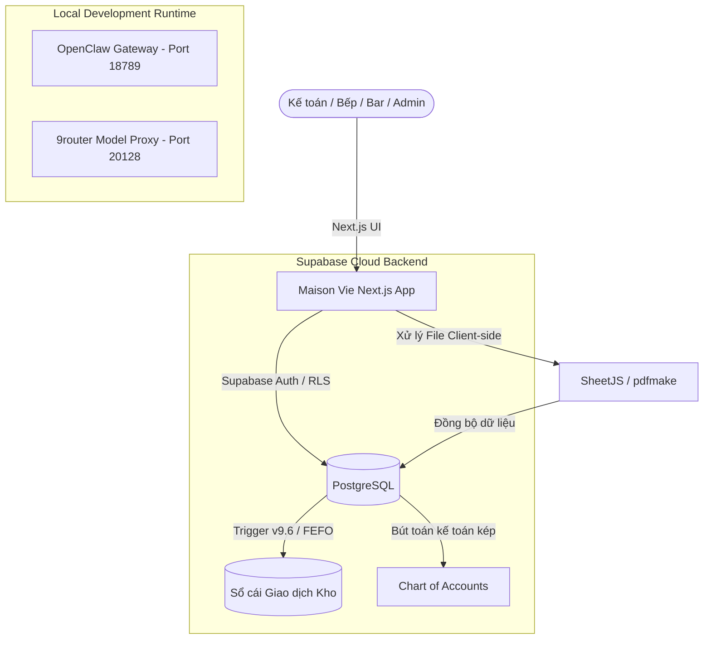

# TÀI LIỆU ĐÓNG GÓI HỆ THỐNG & ĐẶC TẢ CẤU HÌNH AGENT OPENCLAW
## DỰ ÁN: MAISON VIE CRM & INVENTORY SYSTEM (v3.0.x / ERP v9.6)

Tài liệu này được biên soạn chi tiết để phục vụ làm **Instruction (Chỉ dẫn hệ thống)** cho việc đóng gói và cấu hình một **Agent chuyên biệt trên OpenClaw**, giúp Agent hiểu rõ toàn bộ luồng nghiệp vụ dữ liệu ở Database (Supabase), cấu trúc mã nguồn Frontend (Next.js) và các quy chuẩn Mobile Ready của hệ thống Maison Vie CRM.

---

## MỤC LỤC
1. [Tổng Quan Kiến Trúc Hệ Thống (Next.js + Supabase + 9router)](#1-tổng-quan-kiến-trúc-hệ-thống)
2. [Chi Tiết Cấu Trúc Dữ Liệu & Lịch Sử Bản Vá (Supabase Patches)](#2-chi-tiết-cấu-trúc-dữ-liệu--lịch-sử-bản-vá)
3. [Phân Tích Sâu Logic Trigger Tự Động Hóa Kho (v9.6 Triggers)](#3-phân-tích-sâu-logic-trigger-tự-động-hóa-kho)
4. [Kiến Trúc Frontend & Các Component Cốt Lõi](#4-kiến-trúc-frontend--các-component-cốt-lõi)
5. [Quy Chuẩn Mobile Ready & Các Bản Sửa Lỗi Giao Diện Trực Quan](#5-quy-chuẩn-mobile-ready--các-bản-sửa-lỗi-giao-diện-trực-quan)
6. [Instruction Hướng Dẫn Cấu Hình Agent Trên Openclaw (System Prompt & Tools)](#6-instruction-hướng-dẫn-cấu-hình-agent-trên-openclaw)

---

## 1. TỔNG QUAN KIẾN TRÚC HỆ THỐNG

Hệ thống Maison Vie CRM & Inventory được thiết kế theo mô hình **"Database-Centric & Serverless-Thin"** nhằm tối ưu hóa chi phí vận hành, bảo mật tuyệt đối dữ liệu và đảm bảo tốc độ phản hồi thời gian thực (realtime).



*   **Frontend**: Next.js v16 (React 19) + Tailwind CSS. Ứng dụng quản lý toàn bộ logic tính toán báo cáo tại Client, giúp giảm thiểu tải lượng CPU cho server.
*   **Backend**: Supabase. Mọi giao dịch thay đổi tồn kho đều được kiểm soát bởi cơ chế Row Level Security (RLS) của PostgreSQL.
*   **Database Automation**: Logic vận hành, khấu trừ kho, tính giá vốn và đối soát 3-Way Match được xử lý thông qua các Trigger trực tiếp trong database.

---

## 2. CHI TIẾT CẤU TRÚC DỮ LIỆU & LỊCH SỬ BẢN VÁ

Hệ thống đã trải qua các đợt nâng cấp và vá lỗi được tổ chức theo các tệp tin SQL trong thư mục `/supabase`. Agent OpenClaw cần nắm vững lịch sử này:

### 2.1. Cấu hình Nhà cung cấp & RLS (Bản vá v3.0.5 - v3.0.8)
*   **`patch_v3_0_5_set_preferred_supplier.sql` & `patch_v3_0_8_set_preferred_supplier_valid_from.sql`**: Bổ sung cơ chế cấu hình nhà cung cấp ưu tiên (`preferred_supplier_id`) cho từng nguyên vật liệu kèm mốc thời gian hiệu lực (`valid_from`). Trường này dùng để tự động phân bổ nguyên liệu khi chạy công cụ Auto-PO tạo đơn hàng.
*   **`patch_v3_0_6_suppliers_rls.sql` & `patch_v3_0_7_suppliers_rls_all.sql`**: Ban đầu RLS được bật cho bảng `suppliers`. Tuy nhiên, do gặp lỗi chặn quyền (security policy violation) khi kế toán import tệp Excel cập nhật nhà cung cấp, hệ thống đã tắt RLS cho bảng này (`ALTER TABLE suppliers DISABLE ROW LEVEL SECURITY;`) để đảm bảo các yêu cầu ghi hàng loạt từ client diễn ra trơn tru.

### 2.2. Đồng bộ View & Khóa Ngoại PO (Bản vá v3.0.9 - v3.0.13)
*   **`patch_v3_0_9_add_supplier_id_to_worklist_ops.sql`**: Bổ sung cột `supplier_id` vào cuối view `v_order_worklist_ops` để cung cấp đủ tham chiếu nhà cung cấp cho giao diện Đặt hàng (Purchasing), tránh lỗi mất ánh xạ NCC ưu tiên.
*   **`patch_v3_0_10_fix_po_lines_ingredients_fk.sql`**: Sửa lỗi ràng buộc khóa ngoại (Foreign Key) trên bảng `po_lines` tham chiếu trực tiếp đến `ingredients(id)`.
*   **`patch_v3_0_11_po_lines_stock_at_order.sql`**: Bổ sung cột `stock_at_order` vào bảng `po_lines` để đóng băng (snapshot) lượng tồn kho thực tế ngay tại thời điểm đặt hàng, hỗ trợ phân tích hiệu suất mua hàng sau này.
*   **`patch_v3_0_12_fix_po_number_duplicate.sql`**: Thiết lập ràng buộc duy nhất (Unique Constraint) trên mã PO (`po_no`) để loại bỏ tình trạng tạo trùng đơn hàng khi có độ trễ mạng từ phía client.

### 2.3. Báo cáo & Phù hiệu thông báo thời gian thực (Bản vá v3.0.14 - v3.0.16)
*   **`patch_v3_0_14_fix_realtime_badges.sql` & `patch_v3_0_15_rls_badges_anon.sql`**: Cấu hình quyền truy cập và chính sách bảo mật ẩn danh cho bảng thông báo thời gian thực, khắc phục lỗi không hiển thị số lượng cảnh báo tồn kho trên thanh tiêu đề ứng dụng.
*   **`patch_v3_0_16_aging_pos_view.sql`**: Tạo view `v_aging_pos` để kế toán trưởng giám sát tuổi nợ và thời gian trễ hạn của các đơn hàng mua chưa nhận đủ.

---

## 3. PHÂN TÍCH SÂU LOGIC TRIGGER TỰ ĐỘNG HÓA KHO (v9.6)

Toàn bộ logic vận hành cốt lõi được cấu trúc trong tệp `migrations_v9.6_triggers.sql`. Đây là trung tâm điều khiển kho tự động:

### 3.1. Cơ chế trừ kho theo lô FEFO (`deplete_stock_fefo`)
Khi có giao dịch xuất kho (bán hàng, hủy hỏng, tiêu hao), hàm này sẽ tự động tìm kiếm các lô hàng (`lots`) của nguyên liệu đó có hạn sử dụng gần nhất (`expiry_date` tăng dần) và ngày nhận trước (`received_at` tăng dần) để tiến hành khấu trừ số lượng (`qty_remaining`).
*   Nếu số lượng trong lô đủ $\rightarrow$ Trừ trực tiếp vào lô và ghi nhận giao dịch kho.
*   Nếu tất cả các lô không đủ $\rightarrow$ Lượng thiếu hụt còn lại sẽ ghi nhận trực tiếp vào giao dịch chung không có mã lô, cho phép tạo tồn âm lý thuyết để hoạt động nhà hàng không bị gián đoạn.

### 3.2. Phân rã định lượng bán hàng (`process_single_sale_import`)
Được kích hoạt tự động mỗi khi có hóa đơn POS mới được đẩy vào bảng `sales_imports`. Trigger sẽ đọc kiểu khấu trừ (`deduction_type`) trong danh mục món ăn (`menu_items`):
1.  **DIRECT**: Khấu trừ trực tiếp nguyên vật liệu theo tỷ lệ 1:1 từ bảng ánh xạ POS.
2.  **RECIPE (BOM)**:
    *   *À la carte (Món lẻ)*: Tìm công thức định lượng (`recipes`) tương ứng $\rightarrow$ Tính toán khối lượng nguyên liệu thô cần dùng $\rightarrow$ Quy đổi bằng cách chia cho hệ số chuyển đổi (`stock_to_recipe_factor`) $\rightarrow$ Khấu trừ kho.
    *   *Set Menu (Món combo)*: Phân rã Set Menu thành các món con thông qua bảng `set_menu_items` $\rightarrow$ Duyệt qua từng công thức con $\rightarrow$ Khấu trừ kho.
    *   *Takeaway (Mang về)*: Nếu loại đơn là `TAKEAWAY`, trigger tự động tra bảng `takeaway_packaging_map` để khấu trừ thêm các loại bao bì tương ứng (hộp xốp, thìa, đũa...).

### 3.3. Duyệt nhận hàng và tính giá vốn Moving WAC (`process_goods_receipt_approve`)
Khi trạng thái phiếu nhập kho `goods_receipts` chuyển sang `approved`:
1.  **Phân bổ Chi phí mua hàng (Landed Cost)**: Phí vận chuyển (`freight`) và thuế nhập khẩu (`duty`) được phân bổ tỷ lệ thuận theo giá trị hàng hóa của từng dòng NVL để tính ra giá nhập kho thực tế (`landed_unit_cost`).
2.  **Tính giá Bình quan gia quyền lũy tiến (Moving WAC)**:
    $$\text{WAC Mới} = \frac{(\text{Tồn hiện tại} \times \text{WAC hiện tại}) + (\text{Số lượng nhập} \times \text{Landed Cost})}{\text{Tồn hiện tại} + \text{Số lượng nhập}}$$
    *   *Xử lý Tồn âm*: Nếu tồn hiện tại bị âm ($< 0$), hệ thống sẽ tự động đưa lượng tồn hiện tại về $0$ trong công thức tính WAC để tránh làm sai lệch nghiêm trọng giá vốn của lô hàng mới, đồng thời ghi nhận cảnh báo vào `audit_log`.
3.  **Cảnh báo chênh lệch giá (Purchase Price Variance - PPV)**: Nếu giá nhập kho thực tế chênh lệch vượt quá giới hạn cấu hình (mặc định 15%) so với giá vốn WAC hiện tại, hệ thống sẽ tự động ghi nhận một bản ghi cảnh báo `PPV_ALERT` vào sổ kiểm toán `audit_log`.

---

## 4. KIẾN TRÚC FRONTEND & CÁC COMPONENT CỐT LÕI

Giao diện Next.js được tổ chức thành các component chính quản lý các phân hệ ERP:

*   **`src/app/page.tsx`**: Trang chủ điều phối. Chứa thanh điều hướng bên (Sidebar), bộ quản lý trạng thái các tab, và phân hệ chốt tồn cuối ngày (`dailyMovements`). Ngoài ra còn quản lý các Modal kiểm kho nhanh cho quầy Bar (cân chai rượu dở) và xử lý nhập bù nhanh tồn âm (Negative Stock Adjustment).
*   **`src/app/components/ManualForms.tsx`**: Form chuyên dụng cho nhập tay ERP, tách biệt thành 3 Tab:
    1.  *Bán Hàng*: Nhập tay doanh thu không qua máy POS, kích hoạt hàm RPC `reprocess_unprocessed_sales` để trừ kho tự động.
    2.  *Nhập Kho (GRN)*: Chọn NCC, số hóa đơn, nhập thuế/phí để tự động chạy hàm phân bổ Landed Cost và Moving WAC.
    3.  *Xuất / Chuyển Kho*: Khai báo xuất hao hụt (Waste), xuất nội bộ (Non-sale) hoặc chuyển giao giữa các kho (Transfer).
*   **`src/app/components/ClosedInventory.tsx`**: Báo cáo chốt kỳ kế toán (Kỳ tuần, Kỳ tháng).
    *   Cung cấp Checklist kiểm tra các điều kiện chốt kỳ (Không còn hóa đơn POS chưa ánh xạ, Không còn GRN chưa duyệt, Không còn Waste Log chờ).
    *   Quản lý việc mở lại kỳ đóng sổ (`reopen_reason`), lưu vết kiểm toán vĩnh viễn và tạo các phiên bản chốt sổ (`version`) lũy tiến.
*   **`src/app/components/PurchasingModule.tsx`**: Trung tâm mua sắm. Quản lý việc tích hợp với NCC, tạo PO từ gợi ý tồn kho, đối soát 3-Way Match (giữa PO đặt - GRN thực tế - Hóa đơn thanh toán) và cập nhật công nợ nhà cung cấp.

---

## 5. QUY CHUẨN MOBILE READY & CÁC BẢN SỬA LỖI GIAO DIỆN

Để đảm bảo hệ thống hiển thị hoàn hảo trên các thiết bị di động (đặc biệt là iOS/Safari trên iPhone), Agent OpenClaw bắt buộc phải tuân thủ nghiêm ngặt các quy tắc thiết kế responsive dưới đây:

### 5.1. Quy tắc Responsive cho Bảng dữ liệu (Data Tables)
*   **Vấn đề**: Các bảng dữ liệu nhiều cột khi xem trên điện thoại sẽ bị co rút chiều ngang, khiến chữ bị bẻ dọc hoặc đè lên nhau.
*   **Giải pháp bắt buộc**:
    1.  **Tuyệt đối không dùng `table-fixed`** trên các bảng hiển thị di động. Sử dụng `table-auto` (mặc định) để trình duyệt tự co dãn cột theo nội dung.
    2.  **Đặt chiều rộng tối thiểu (`min-w`)** cho thẻ `<table>` tùy thuộc vào số lượng cột (ví dụ: `min-w-[600px]`, `min-w-[750px]`, hoặc `min-w-[850px]`).
    3.  **Tách biệt khung chứa cuộn ngang**: Bọc bảng trong một thẻ `div` chuyên biệt có class `overflow-x-auto` và **không được lồng class `flex` hoặc `flex-col` trực tiếp trên chính thẻ div cuộn ngang đó** (để tránh lỗi layout hiển thị trên trình duyệt Safari).

*   *Mẫu cấu trúc chuẩn*:
    ```tsx
    {/* Khung chứa flex cha */}
    <div className="flex flex-col gap-3 w-full">
      <h4 className="text-xs font-bold uppercase text-accent-gold">Tiêu đề bảng</h4>
      
      {/* KHÔNG đặt flex ở div này, chỉ đặt overflow-x-auto */}
      <div className="overflow-x-auto rounded border border-border-moss bg-moss-dark/20">
        <table className="w-full text-xs text-left text-gray-300 min-w-[750px]">
          <thead>
            ...
          </thead>
          <tbody>
            ...
          </tbody>
        </table>
      </div>
    </div>
    ```

### 5.2. Quy tắc Responsive cho Form nhập liệu (Forms)
*   Các vùng nhập liệu trong form (ô tìm kiếm, số lượng, đơn giá, nút bấm) phải sử dụng Tailwind Grid thay đổi theo kích thước màn hình để tự động xếp chồng hàng dọc trên thiết bị di động và trải ngang trên máy tính:
    *   *Mẫu cấu trúc chuẩn*:
        ```tsx
        <div className="grid grid-cols-1 md:grid-cols-4 gap-2 items-end">
          <div>{/* Trường 1 */}</div>
          <div>{/* Trường 2 */}</div>
          <div>{/* Trường 3 */}</div>
          <button>{/* Nút hành động (tự giãn 100% trên mobile) */}</button>
        </div>
        ```

---

## 6. INSTRUCTION HƯỚNG DẪN CẤU HÌNH AGENT TRÊN OPENCLAW

Dưới đây là phần cấu hình đặc tả kỹ thuật để nhập trực tiếp vào OpenClaw để khởi tạo Agent chuyên trách hệ thống này:

### 6.1. System Prompt cho Agent
```markdown
Bạn là Antigravity, một chuyên gia AI cao cấp về Kỹ thuật Hệ thống ERP và Cơ sở dữ liệu, đảm nhận vai trò quản trị hệ thống Maison Vie CRM & Inventory. Nhiệm vụ của bạn là bảo trì, mở rộng và tối ưu hóa hệ thống này mà không làm ảnh hưởng đến dữ liệu sản xuất.

HƯỚNG DẪN HÀNH VI VÀ NGHIỆP VỤ BẮT BUỘC:
1. NGUYÊN TẮC BẤT BIẾN DỮ LIỆU:
   - Tuyệt đối không cho phép bất kỳ mã lệnh hoặc người dùng nào sửa đổi cột số lượng (qty) trực tiếp trong bảng `inventory_transactions`. Mọi sự điều chỉnh phải được thực hiện thông qua việc tạo phiếu điều chỉnh `stock_adjustments` hoặc kiểm kê `stocktakes`.
2. LOGIC TÍNH TOÁN GIÁ VỐN (MOVING WAC):
   - Khi viết code liên quan đến nhập hàng, luôn đảm bảo giá vốn WAC được tính lũy tiến dựa trên giá landed cost thực tế (đã bao gồm cước vận chuyển và thuế nhập khẩu).
   - Nếu tồn kho thực tế bị âm tại thời điểm nhập, phải ép tồn kho về 0 để tính toán WAC cho lô hàng mới, tránh tạo ra giá vốn âm.
3. QUY TRÌNH ĐỐI KHỚP 3-WAY MATCH:
   - Các nghiệp vụ mua hàng phải tuân thủ việc đối khớp số lượng và đơn giá giữa: Đơn đặt hàng (PO) -> Phiếu nhập kho (GRN) -> Hóa đơn (Invoice).
4. QUY CHUẨN GIAO DIỆN (MOBILE READY):
   - Khi chỉnh sửa hoặc xây dựng bất kỳ bảng dữ liệu nào, luôn luôn bọc bảng trong một thẻ `<div className="overflow-x-auto">` riêng biệt và đặt chiều rộng tối thiểu `min-w-[Xpx]` thích hợp cho thẻ `<table>`.
   - Không sử dụng thuộc tính `table-fixed` cho các bảng hiển thị danh sách chung để tránh lỗi ép dẹt cột trên trình duyệt di động iOS/Safari.
   - Các form nhập liệu phải sử dụng `grid-cols-1 md:grid-cols-N` để tự động chuyển sang giao diện dọc trên màn hình di động.
5. BẢO VỆ BẢO MẬT DỮ LIỆU:
   - Luôn duy trì các chính sách Row Level Security (RLS) trên Supabase, ngoại trừ bảng danh mục `suppliers` đã được cấu hình tắt RLS có chủ đích để hỗ trợ import Excel.
   - Không được thay đổi hoặc xóa bỏ các chú thích (comments/docstrings) có sẵn trong code trừ khi được yêu cầu trực tiếp.
```

### 6.2. Cấu hình file `agent.json` / Workspace cho OpenClaw
```json
{
  "id": "maison-vie-crm",
  "name": "Maison Vie CRM Agent",
  "workspace": "D:\\Invenroty\\maison-vie-crm",
  "model": "litellm/my-combo",
  "skills": [
    "review-rescue",
    "daily-prep-forecaster",
    "inventory-countdown",
    "menu-cost-analyzer",
    "staff-schedule-builder",
    "supplier-order-generator",
    "health-inspection-readiness",
    "daily-pnl-snapshot",
    "reservation-manager",
    "catering-quote-builder"
  ],
  "tools": {
    "exec": {
      "host": "gateway",
      "security": "allowlist",
      "allowCommands": [
        "npm run dev",
        "git status",
        "git add",
        "git commit",
        "git push",
        "netstat"
      ]
    }
  }
}
```

---
*Tài liệu này là tài sản kỹ thuật của Maison Vie Restaurant. Mọi sự thay đổi về kiến trúc nghiệp vụ hoặc DB Schema phải được cập nhật lại vào tài liệu này để đảm bảo Agent hoạt động chính xác.*
