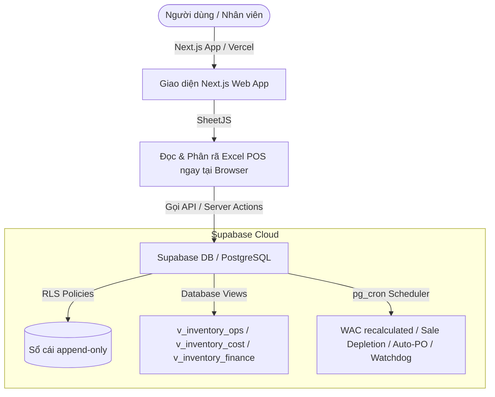

# BÀN GIAO HỆ THỐNG CRM/ERP INVENTORY – MAISON VIE v8.0
### (Tài liệu kỹ thuật và kiến trúc hệ thống dành cho COO / CFO / System Admin)

Tài liệu này hướng dẫn chi tiết về mặt kỹ thuật, kiến trúc cơ sở dữ liệu, phân tầng bảo mật, và cấu hình tự động của hệ thống CRM/ERP Inventory của Maison Vie v8.0.

---

## 1. KIẾN TRÚC TỔNG THỂ (System Architecture)

Hệ thống Maison Vie CRM/ERP Inventory được xây dựng dựa trên nguyên tắc **"Database-centric, serverless-thin"** nhằm tối đa hóa độ chính xác của số liệu tài chính đồng thời giữ chi phí vận hành ở mức tối thiểu.



*   **Tầng Giao diện (Frontend - Vercel)**: Next.js (React) chạy mỏng. Các tính năng nặng như đọc và phân tích file Excel POS được thực hiện trực tiếp trên trình duyệt của người dùng thông qua thư viện **SheetJS**, giảm thiểu chi phí Compute và thời gian chạy Serverless Functions của Vercel (giới hạn 10s/request gói Free).
*   **Tầng Cơ sở dữ liệu (Backend - Supabase)**: Chứa toàn bộ logic nghiệp vụ (WAC, trừ kho, Auto-PO, variance) viết bằng **PL/pgSQL**. Các công việc định kỳ được xử lý bởi extension **`pg_cron`** chạy trực tiếp trong cơ sở dữ liệu.
*   **Nguyên tắc Bất biến (Append-Only Ledger)**: Mọi biến động kho đều được lưu tại một bảng duy nhất là `inventory_transactions`. Không cho phép bất kỳ vai trò nào thực hiện `UPDATE` hoặc `DELETE` trên bảng này. Nếu có sai sót, nhân viên bắt buộc phải tạo **bút toán đảo (reversal entry)** để sửa đổi, đảm bảo tính minh bạch kiểm toán.

---

## 2. PHÂN QUYỀN BẢO MẬT & PHÂN TÁCH VIEW TÀI CHÍNH (RBAC & RLS)

Để giải quyết vấn đề rò rỉ thông tin giá vốn và doanh thu, hệ thống không cho phép các vai trò thông thường truy cập trực tiếp vào các bảng cơ sở dữ liệu gốc. Thay vào đó, dữ liệu được phân tách qua **3 tầng Database View** kết hợp kiểm tra quyền ở Next.js Server Side:

1.  **`v_inventory_ops` (View Vận hành)**: Loại bỏ hoàn toàn các cột giá vốn (WAC), giá trị tồn kho (VND), và doanh thu. Dành cho Cấp 2 (Quản lý), Cấp 3 (Bếp trưởng), Cấp 5 (Giám sát), Cấp 6 (Bếp phó), Cấp 7 (Thủ kho).
2.  **`v_inventory_cost` (View Kế toán kho)**: Hiển thị số lượng kèm theo giá vốn WAC để làm báo cáo nhập hàng, 3-way match, và duyệt Auto-PO, nhưng **không hiển thị** doanh thu POS hay Food Cost %. Dành cho Cấp 4 (Kế toán kho cấp cao).
3.  **`v_inventory_finance` (View Tài chính)**: Hiển thị đầy đủ số lượng, giá vốn WAC, doanh thu POS, giá trị kho VND và Food Cost %. **Chỉ dành riêng cho Cấp 1 (CFO/Owner/Admin)**.

### 🔒 Bảo mật tuyệt đối "Tổng Doanh thu POS"
*   **Tầng Database**: Quyền `SELECT` trên bảng `goods_receipts` và view `v_inventory_finance` chỉ được cấp cho admin.
*   **Tầng UI (Next.js)**: Component hiển thị thẻ **"Tổng Doanh thu POS"** trong Dashboard được bọc hoàn toàn bằng điều kiện cứng `userRole === 'admin'`. Các vai trò khác sẽ không nhìn thấy thẻ này (đã ẩn hoàn toàn khỏi giao diện, thay vì hiển thị dạng khóa như các phiên bản trước).

---

## 3. LOGIC NGHIỆP VỤ CỐT LÕI (v8.0)

### 3.1. Tính Moving WAC Bảo vệ Tồn kho Âm
Khi kế toán nhập hóa đơn trễ hơn thực tế bán hàng, tồn kho lý thuyết bị âm. Công thức tính WAC mới tự động điều chỉnh số lượng tồn về 0 nếu phát hiện số âm trước khi cộng lô mới:
```sql
adjusted_qty_on_hand = max(qty_on_hand, 0);

new_wac = (adjusted_qty_on_hand * current_wac + qty_received * landed_unit_cost) 
          / (adjusted_qty_on_hand + qty_received);
```
*   **Landed Cost**: Đã phân bổ thuế nhập khẩu (`duty`) và phí vận chuyển (`freight`) vào đơn giá vốn nguyên liệu thực tế dựa trên tỷ trọng giá trị dòng hàng.

### 3.2. Quy đổi Đơn vị tính (UoM Conversion System)
*   **Bảng `uom_conversions` (Toàn cục)**: Chỉ lưu các tỷ lệ quy đổi vật lý cố định (VD: `KG` -> `G` = 1000, `L` -> `ML` = 1000).
*   **Quy đổi khi Nhập kho (Nhà cung cấp -> Tồn)**: Cấu hình tại `supplier_ingredients.pack_size`. Ví dụ: 1 Thùng Heineken (`CASE`) = 24 Chai (`BOTTLE`).
*   **Quy đổi khi Trừ kho (Tồn -> Công thức)**: Cấu hình tại `ingredients.stock_to_recipe_factor`. Ví dụ: 1 Chai rượu (`BOTTLE`) = 750 `ML`. Khi trừ kho, lượng rượu dùng trong công thức (ML) sẽ được chia cho 750 để quy ra số lượng chai tương ứng.

### 3.3. Trừ kho FEFO & Khử nhiễu Variance
*   **FEFO (First Expired, First Out)**: Tự động trừ kho theo các lô có hạn sử dụng (`expiry_date`) gần nhất đối với các nhóm hàng cần theo dõi lô (`track_lot = true`).
*   **Tolerance Threshold (Ngưỡng dung sai lọc nhiễu)**: Mỗi nguyên vật liệu được gán một mức `tolerance_percent` (Nhóm A giá trị cao: 1-2%, Nhóm B trung bình: 5%, Nhóm C gia vị thấp: 10-15%). Chỉ các sai lệch vượt ngưỡng dung sai mới kích hoạt cảnh báo đỏ trên báo cáo Variance.

---

## 4. TỰ ĐỘNG HÓA VÀ LẬP LỊCH (pg_cron Scheduler)

Hệ thống lập lịch tự động hàng ngày trong cơ sở dữ liệu bằng `pg_cron` (múi giờ Asia/Ho_Chi_Minh):
*   **18:30 (Chốt WAC)**: Tạo snapshot giá vốn trong ngày để phục vụ báo cáo.
*   **22:30 (Trừ kho POS)**: Phân rã món ăn bán trong ngày thành định mức nguyên liệu thô, trừ trực tiếp tồn kho lý thuyết.
*   **22:40 (Auto-PO)**: Tính toán nhu cầu hàng hóa dự kiến dựa trên trung bình động tiêu thụ 14 ngày gần nhất, tạo đơn đặt hàng nháp cho các nhà cung cấp nếu lượng tồn xuống dưới mức tồn an toàn.
*   **23:00 (Watchdog)**: Kiểm tra trạng thái đóng sổ ngày (`daily_close`). Nếu phát hiện lỗi hoặc thiếu bước, tự động bắn email cảnh báo khẩn cấp cho ban quản trị thông qua Resend API.

---

## 5. KHUYẾN NGHỊ TRIỂN KHAI VÀ HẠ TẦNG

> [!IMPORTANT]
> **Khuyến nghị nâng cấp Supabase Pro**:
> Maison Vie nên sử dụng gói **Supabase Pro (khoảng $25/tháng)** cho môi trường chạy thật. Gói Free của Supabase có giới hạn tự động pause dự án sau 7 ngày không hoạt động, không hỗ trợ PITR (Point-in-Time Recovery - sao lưu khôi phục theo từng giây) và hạn chế hiệu năng xử lý `pg_cron` cho các bút toán lớn cuối ngày.
